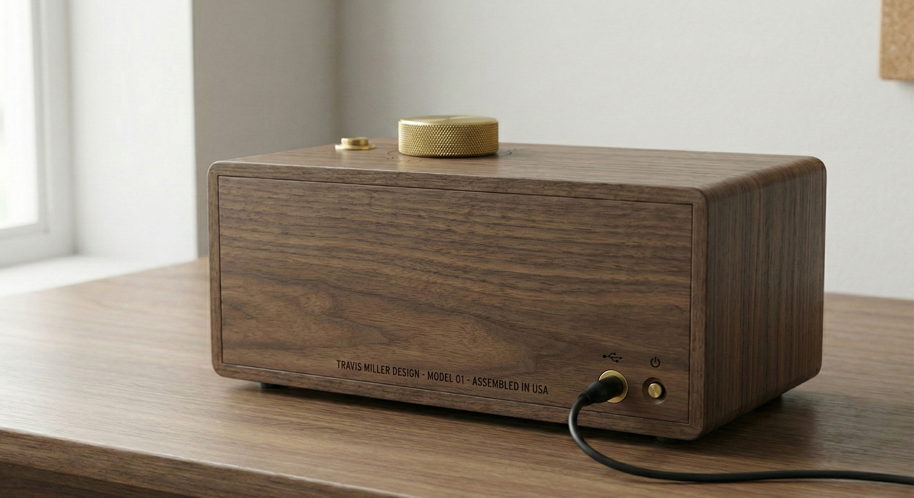

# Project: PC-1 (Paper Console 1)

**A fully-customizable, offline-first device that curates the digital world into a physical artifact.**
*Status: V1 Prototype*
*Date: November 2025*

---

## 1. Project Vision

To build a "Calm Technology" appliance that respects user attention.
* **No Screens:** Output is physical thermal paper.
* **No Subscriptions:** User-owned API keys or local algorithms.
* **Heirloom Quality:** Walnut, Brass, and archival-grade paper.
* **Universal Channels:** Fully configurable channels (News, Email, Webhooks, Games, Notes, Calendar).


*Front view showing the brass rotary dial, push button, and thermal paper output*


*Back view showing power cord and power button*

---

## 2. Quick Start

### Development/Testing
Run the entire system on your PC without hardware to test logic and see "printer" output in the terminal.

**Backend:**
```bash
# Linux / macOS / Git Bash
./run.sh

# Windows CMD
run.bat
```
* **API Docs:** [http://localhost:8000/docs](http://localhost:8000/docs)
* **Mock Output:** Watch your Terminal window. The "Printer" writes text there.

**Frontend (Settings UI):**
```bash
cd web
npm install  # First time only
npm run dev
```
* **URL:** [http://localhost:5173](http://localhost:5173)

### Option B: Hardware Setup (Raspberry Pi)
See [Installation & Setup](#3-installation--setup) below for complete hardware installation instructions.

---

## 3. Installation & Setup

### Prerequisites
1. **Raspberry Pi Zero 2 W** with Raspberry Pi OS Lite installed
2. **Thermal Printer** (QR204/CSN-A2 or compatible 58mm TTL/USB thermal printer)
3. **1-Pole 8-Position Rotary Switch**
4. **Momentary Push Button** (optional, for manual trigger)
5. **Power Supply:** 5V 5A Power Supply (Barrel Jack) -> Terminal Adapter

### Software Installation

1. **Install Python Dependencies:**
   ```bash
   pip install -r requirements.txt
   ```
   This installs `pyserial`, `RPi.GPIO`, and other dependencies.

2. **Run Setup Script:**
   ```bash
   cd ~/paper-console
   chmod +x scripts/setup_pi.sh
   sudo scripts/setup_pi.sh
   ```
   The script will:
   - Set hostname (default: `pc-1`)
   - Install Nginx (web proxy) and Avahi (mDNS)
   - Configure systemd service
   - Add user to `lp` group for printer access

3. **Access the Device:**
   Open your browser and go to `http://pc-1.local` (or your chosen hostname).

### Hardware Wiring

#### Thermal Printer

**USB Connection (Recommended):**
1. Connect printer to USB port on Raspberry Pi
2. Device appears as `/dev/usb/lp0` (USB Line Printer)
3. Permissions handled automatically by `setup_pi.sh`

**TTL Serial Connection (Advanced):**
1. Connect:
   - **VCC** → 5V (Pin 2 or 4)
   - **GND** → Ground (Pin 6)
   - **RX** → GPIO 14 (TXD, Pin 8)
   - **TX** → GPIO 15 (RXD, Pin 10)
2. Enable serial in `raspi-config` → Interface Options → Serial Port
3. Device appears as `/dev/serial0`

**Note:** The system auto-detects printers in this order:
1. `/dev/usb/lp0` (Direct USB)
2. `/dev/ttyUSB0` (Serial to USB)
3. `/dev/serial0` (GPIO Serial)

#### Rotary Switch (8-Position Dial)

**Wiring:**
- **Common terminal** → GND
- **Position 1** → GPIO 5 (Pin 29)
- **Position 2** → GPIO 6 (Pin 31)
- **Position 3** → GPIO 13 (Pin 33)
- **Position 4** → GPIO 19 (Pin 35)
- **Position 5** → GPIO 26 (Pin 37)
- **Position 6** → GPIO 16 (Pin 36)
- **Position 7** → GPIO 20 (Pin 38)
- **Position 8** → GPIO 21 (Pin 40)

**Note:** GPIO pins can be customized in `app/drivers/dial_gpio.py`.

#### Push Button (Optional)

**Wiring:**
- **One terminal** → GPIO 18 (Pin 12)
- **Other terminal** → GND
- Add 10kΩ pull-up resistor between GPIO 18 and 3.3V (or use internal pull-up)

#### Power Supply

**Shared Power Setup:**
- Use a 5V 5A power supply with a terminal adapter
- Split power in parallel: one branch to Pi, one branch to Printer
- Connect data lines (USB) separately
- **Important:** Do not power printer through Pi GPIO pins (insufficient current)

---

## 4. Configuration

Configuration is handled entirely via the **Web UI** at `http://pc-1.local` (or `http://localhost:8000` if running locally).

### Global Settings
* **Location:** City name, Latitude, Longitude, Timezone (with search functionality)
* **Time Format:** 12-hour (AM/PM) or 24-hour format

### Channel System
* **8 Channel Positions:** Each position (1-8) represents a slot on the rotary dial
* **Modular System:** Channels are containers. You can assign **multiple modules** to a single channel (e.g., "News" followed by "Weather" followed by "Sudoku")
* **Reordering:** 
  * **Channels:** Use Up/Down arrows next to Channel title to swap entire channels
  * **Modules:** Use arrow buttons within a channel card to change print order
* **Scheduled Printing:** Click the clock icon on any channel to schedule automatic printing at specific times

### Module Types

Each module is an independent instance with its own configuration:

1. **News API:** Prints top headlines from NewsAPI (requires API key)
2. **RSS Feeds:** Prints articles from custom RSS feed URLs
3. **Weather:** Prints current weather + forecast (OpenMeteo, no key required)
4. **Email Inbox:** Connects via IMAP to print unread emails (auto-polls every 30s by default)
5. **Sudoku:** Generates a Sudoku puzzle (Medium/Hard difficulty)
6. **Astronomy:** Prints sunrise, sunset, moon phase (uses global location)
7. **Calendar:** Fetches and prints upcoming events from iCal calendars (Google Calendar, Apple Calendar, etc.)
8. **Webhook:** Makes GET/POST requests to any URL and prints the result
9. **Text / Note:** Prints static text notes (WiFi passwords, to-do lists, etc.)

### Settings Storage
* **Settings File:** `config.json` (managed automatically, gitignored)
* **Auto-Save:** All changes saved instantly
* **Reset:** "Reset All Settings" button in UI restores factory defaults
* **Environment Variables:** Legacy `.env` file support (UI configuration preferred)

---

## 5. Architecture & Modules

**Philosophy:** Local-First, API-Agnostic, Privacy-Centric.

### Tech Stack
* **OS:** Raspberry Pi OS Lite (64-bit)
* **Backend:** Python 3.12 + FastAPI (API & Logic)
* **Frontend:** React + Vite + Tailwind CSS v4 (Hosted locally on Pi)
* **Storage:** `config.json` (JSON file for settings persistence)
* **Key Dependencies:** 
  * `icalendar` & `python-dateutil` (Calendar parsing)
  * `feedparser` (RSS feed parsing)
  * `pytz` (Timezone handling)
  * `requests` (HTTP requests for APIs/webhooks)

### Module Details

**News API:**
* Sources: NewsAPI (top headlines)
* Requires: NewsAPI key

**RSS Feeds:**
* Sources: Custom RSS feeds (unlimited)
* Supports: Any valid RSS feed URL

**Weather:**
* Sources: Open-Meteo API (no key required)
* Uses: Global location from settings

**Email Inbox:**
* Protocol: IMAP
* Auto-Poll: Configurable interval (default 30s)
* Features: Prints unread emails automatically

**Sudoku:**
* Difficulty: Medium or Hard
* Algorithm: Backtracking solver with random generation

**Astronomy:**
* Features: Sunrise, Sunset, Moon Phase/Illumination
* Uses: Global location from settings

**Calendar:**
* Sources: iCal URLs (Google Calendar, Apple Calendar, etc.)
* Features: 
  * Supports public and secret iCal URLs
  * Merges multiple calendars
  * Handles recurring events
  * Timezone-aware scheduling
  * Event expansion (1-7 days ahead)

**Webhook:**
* Methods: GET or POST
* Features: Custom headers, JSON body, JSON path extraction
* Use Cases: Dad Jokes, Random Facts, IoT Status, Home Assistant triggers, Custom APIs

**Text / Note:**
* Features: Static multi-line text storage
* Use Cases: WiFi passwords, to-do lists, quick reference notes

---

## 6. Troubleshooting

### Printer Issues
* **Device Not Found:**
  * Check if `/dev/usb/lp0` exists: `ls -l /dev/usb/lp*`
  * Ensure `usblp` kernel module is loaded: `lsmod | grep usblp`
  * Test manually: `echo "Hello" | sudo tee /dev/usb/lp0`
* **Permission Denied:**
  * Ensure user is in `lp` group: `groups`
  * Add user: `sudo usermod -a -G lp $USER` (then log out/in)
* **Nothing Prints:**
  * Check paper orientation (thermal side down)
  * Verify power supply is adequate (5A minimum)
  * Check service logs: `sudo journalctl -u pc-1.service -f`

### Service Issues
* **Restart Loop:**
  * Service uses `run.sh` to handle port conflicts automatically
  * Restart: `sudo systemctl restart pc-1.service`
  * Check logs: `sudo journalctl -u pc-1.service -f`
* **Port Already in Use:**
  * `run.sh` automatically kills zombie processes
  * If persistent, reboot: `sudo reboot`

### Dial Issues
* **Not Reading Positions:**
  * Check wiring: Ensure common terminal is connected to GND
  * Verify GPIO pins match `app/drivers/dial_gpio.py`
  * Test GPIO pins with a simple Python script

### Module-Specific Issues
* **NewsAPI Returns 0 Articles:** Check if API key is valid and on free tier
* **RSS Feeds Not Working:** Ensure RSS feed URLs are valid and accessible
* **Email Auth Failed:** Use a **Google App Password**, not your main password. Ensure 2FA is enabled
* **Calendar Not Showing Events:** Verify iCal URL is correct. Check that events exist in the date range
* **Weather Wrong:** Check `config.json` Lat/Long via UI location search feature
* **Channel Not Triggering:** Verify channel has modules assigned and config is saved

---

## 7. Reference

### GPIO Pin Reference
For Raspberry Pi Zero 2 W (40-pin header):

**Legend:**
- **DIAL-1 to DIAL-8** = Rotary Switch Positions
- **BTN** = Push Button
- **SER** = Serial (TTL printer, optional)

```
    3.3V  [1]  [2]  5V
   GPIO2  [3]  [4]  5V
   GPIO3  [5]  [6]  GND
   GPIO4  [7]  [8]  GPIO14 (SER-TXD)
     GND  [9]  [10] GPIO15 (SER-RXD)
  GPIO17 [11]  [12] GPIO18 (BTN)
  GPIO27 [13]  [14] GND
  GPIO22 [15]  [16] GPIO23
    3.3V [17]  [18] GPIO24
  GPIO10 [19]  [20] GND
   GPIO9 [21]  [22] GPIO25
  GPIO11 [23]  [24] GPIO8
     GND [25]  [26] GPIO7
   GPIO0 [27]  [28] GPIO1
   GPIO5 [29]  [30] GND        ← DIAL-1 (Pin 29)
   GPIO6 [31]  [32] GPIO12     ← DIAL-2 (Pin 31)
  GPIO13 [33]  [34] GND        ← DIAL-3 (Pin 33)
  GPIO19 [35]  [36] GPIO16     ← DIAL-4 (Pin 35) / DIAL-6 (Pin 36)
  GPIO26 [37]  [38] GPIO20     ← DIAL-5 (Pin 37) / DIAL-7 (Pin 38)
   GND   [39]  [40] GPIO21     ← DIAL-8 (Pin 40)
```

**Connections:**
- **Rotary Switch:** 
  - Position 1 → GPIO 5 (Pin 29)
  - Position 2 → GPIO 6 (Pin 31)
  - Position 3 → GPIO 13 (Pin 33)
  - Position 4 → GPIO 19 (Pin 35)
  - Position 5 → GPIO 26 (Pin 37)
  - Position 6 → GPIO 16 (Pin 36)
  - Position 7 → GPIO 20 (Pin 38)
  - Position 8 → GPIO 21 (Pin 40)
  - Common terminal → GND (any GND pin)
- **Push Button:** GPIO 18 (Pin 12) → GND (with pull-up resistor)
- **Serial (Optional):** GPIO 14 (Pin 8, TXD), GPIO 15 (Pin 10, RXD) for TTL printer connection

### Directory Structure
```
paper-console/
├── app/
│   ├── main.py            # Entry point & Event Router
│   ├── config.py          # Pydantic Models & Settings Manager
│   ├── drivers/
│   │   ├── printer_serial.py  # Hardware printer driver
│   │   ├── printer_mock.py    # Console "Printer" (dev)
│   │   ├── dial_gpio.py       # Hardware dial driver
│   │   └── dial_mock.py       # Virtual Rotary Switch (dev)
│   ├── modules/
│   │   ├── news.py        # NewsAPI Logic
│   │   ├── rss.py         # RSS Feed Logic
│   │   ├── weather.py     # Weather Logic (Open-Meteo)
│   │   ├── astronomy.py   # Local Astronomy Logic
│   │   ├── email_client.py# IMAP Logic
│   │   ├── sudoku.py      # Sudoku Logic
│   │   ├── webhook.py     # Generic API/Webhook Logic
│   │   ├── text.py        # Static Text Logic
│   │   └── calendar.py    # iCal Calendar Parsing Logic
│   └── web/               # React + Vite + Tailwind CSS Frontend
├── scripts/
│   └── setup_pi.sh        # Setup script (Hostname, Nginx, Systemd)
├── run.sh                 # Development server launcher
├── run.bat                # Windows development launcher
├── requirements.txt       # Python dependencies
└── readme.md              # This file
```

**Note:** `config.json` and `.env` are gitignored (user-specific configuration).
