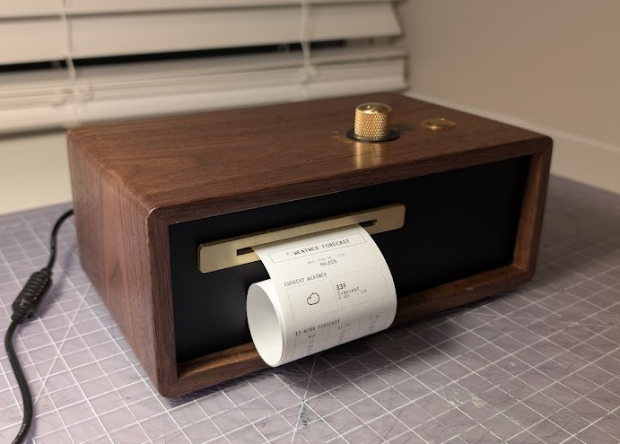

# PC-1 (Paper Console 1)

**A tiny customizable printer that prints news, weather, emails, games, and other content on demand.**
*Status: Consumer Launch Candidate*
*Date: February 2026*

---

* **No screens:** output is physical thermal paper.
* **No subscriptions:** user-owned API keys or local algorithms.
* **Heirloom quality:** walnut, brass, and archival-grade paper.
* **Universal channels:** fully configurable channels (Astronomy, Calendar Integration, Email Integration, On This Day in History, Maze Generator, News, Quote of the Day, RSS Feeds, Sudoku Generator, System Monitor, Text/Note, Weather, Custom Webhooks)


*Front view showing the brass rotary dial, push button, and thermal paper output*

---

## 1. Quick Start (Software)

Run the entire system on your PC without hardware to test logic and see "printer" output in the terminal.

**Backend:**

```bash
# Raspberry Pi / Linux (port 8000)
./run.sh

# Windows (port 8001 to avoid conflicts)
run.bat

# Or run directly
uvicorn app.main:app --host 0.0.0.0 --port 8000 --reload
```

* **API Docs:** 
  * Pi/Linux: [http://localhost:8000/docs](http://localhost:8000/docs)
  * Windows: [http://localhost:8001/docs](http://localhost:8001/docs)
* **Mock Output:** Watch your Terminal window. The "Printer" writes text there.

**Frontend (Settings UI):**
```bash
cd web
npm install
npm run dev
```
* **URL:** [http://localhost:5173](http://localhost:5173)

**Tests (WSL/Linux):**
```bash
./testing/run_tests.sh
```

### Unboxing & First-Use Experience

When a user unboxes a PC-1 and powers it on for the first time, the expected flow is:

1. **First boot prints setup receipt**
   - The printer automatically outputs onboarding instructions.
   - It includes:
     - Setup SSID: `PC-1-Setup-XXXX` (device-specific suffix)
     - Setup password (device-specific by default, or overridden by `PC1_SETUP_PASSWORD`)
     - Setup URL: `http://10.42.0.1` (and `http://pc-1.local`)

2. **User connects to setup WiFi**
   - On phone/computer, connect to the printed SSID.
   - Enter the printed setup password.

3. **User configures home WiFi in the setup web UI**
   - Open `http://10.42.0.1`
   - Choose home network and enter password.
   - The UI explains that connection may drop while PC-1 switches networks.

4. **PC-1 joins home WiFi**
   - Device attempts connection in the background.
   - On success, PC-1 prints a confirmation receipt.
   - User reconnects their phone/computer to home WiFi.

5. **User opens settings**
   - Visit `http://pc-1.local`
   - Configure channels/modules and print behavior.

6. **Normal daily usage**
   - Turn dial to select channel (1-8)
   - Press button to print selected channel
   - Hold button ~5 seconds (half-line paper cue appears at threshold), then release to open **Quick Actions**:
     - `1` Table of Contents
     - `2` System Monitor
     - `3` Reprint Setup Instructions
     - `4` Reset WiFi
     - `5` Reset Factory Settings
     - `8` Cancel
   - Quick Actions are single-shot: after you pick an option, the menu exits automatically.
   - If no option is selected for 2 minutes, Quick Actions auto-exits and prints a timeout note.
   - Hold button ~15 seconds for **Factory Reset** (clears settings and reboots)
   - Use Web UI anytime for editing modules, schedules, and system settings

If WiFi setup fails, PC-1 returns to setup mode so the user can try again.

---

## 2. Software Installation

### Development Environment

1. **Install Python Dependencies:**
   ```bash
   pip install -r requirements.txt
   ```
   This installs `pyserial`, `RPi.GPIO`, and other dependencies.

2. **Run the Server:**
   ```bash
   ./run.sh           # Raspberry Pi/Linux
   run.bat            # Windows
   # Or: uvicorn app.main:app --host 0.0.0.0 --port 8000 --reload
   ```

### Raspberry Pi Deployment

1. **Install Python Dependencies:**
   ```bash
   pip install -r requirements.txt
   ```

2. **Run Setup Script:**
   ```bash
   cd ~/paper-console
   chmod +x scripts/setup_pi.sh
   sudo scripts/setup_pi.sh
   ```
   The script will:
   - Set hostname (default: `pc-1`)
   - Install Nginx (web proxy) and Avahi (mDNS)
   - Configure systemd service
   - Add user to `lp` group for printer access

3. **Access the Device:**
   Open your browser and go to `http://pc-1.local` (or your chosen hostname).

---

## 3. Configuration

Configuration is handled entirely via the **Web UI** at `http://pc-1.local` (or `http://localhost:8000` if running locally).

### Global Settings
* **Location:** City name, Latitude, Longitude, Timezone (with search functionality)
* **Time Format:** 12-hour (AM/PM) or 24-hour format

### Channel System
* **8 Channel Positions:** Each position (1-8) represents a slot on the rotary dial
* **Modular System:** Channels are containers. You can assign **multiple modules** to a single channel (e.g., "News" followed by "Weather" followed by "Sudoku")
* **Reordering:** 
  * **Channels:** Use Up/Down arrows next to Channel title to swap entire channels
  * **Modules:** Use arrow buttons within a channel card to change print order
* **Scheduled Printing:** Click the clock icon on any channel to schedule automatic printing at specific times

### Module Types

Each module is an independent instance with its own configuration. See [Architecture & Modules](#4-architecture--modules) for detailed information.

Available modules: **News API**, **RSS Feeds**, **Weather**, **Email Inbox**, **Sudoku**, **Maze**, **Astronomy**, **Calendar**, **Webhook**, **Text / Note**, **Quotes**, **History**.

### Settings Storage
* **Settings File:** `config.json` (auto-saved, gitignored)
* **Reset:** "Reset All Settings" button restores factory defaults

### Security & Network Environment Variables
For production deployments, configure these environment variables:

* **`PC1_ADMIN_TOKEN`**: Optional admin token for privileged system APIs (time/SSH/update install).  
  When set, clients must send header `X-PC1-Admin-Token`.
* **`PC1_CORS_ORIGINS`**: Comma-separated CORS origins (default is local/dev origins only).
* **`PC1_SETUP_PASSWORD`**: Optional override for setup AP password (must be at least 8 chars).  
  If unset, PC-1 generates a per-device setup password automatically.
* **`PC1_UPDATE_GITHUB_REPO`**: GitHub repo slug used by OTA release checks/install (default: `travmiller/paper-console`).
* **`PC1_UPDATE_TARBALL_SHA256`**: Optional expected SHA256 for OTA tarball verification.
* **`PC1_LOG_LEVEL`**: Backend log level (default: `WARNING` on device builds).
* **`UVICORN_LOG_LEVEL`**: Uvicorn log level for `run.sh` (default: `warning`).
* **`UVICORN_ACCESS_LOG`**: Set to `1` to enable HTTP access logs (default: `0` for lower log volume).

### Production Release Artifacts

For non-git production units, build versioned release artifacts with:

```bash
./.venv/bin/python scripts/release_build.py --version v1.2.3 --build-web
```

See `scripts/RELEASE.md` for the full release/tag/publish workflow.

---

## 4. Architecture & Modules

### Tech Stack
* **OS:** Raspberry Pi OS Lite (64-bit)
* **Backend:** Python 3.12 + FastAPI
* **Frontend:** React + Vite + Tailwind CSS v4

### Directory Structure
```
paper-console/
├── app/
│   ├── main.py            # Entry point & Event Router
│   ├── config.py          # Pydantic Models & Settings Manager
│   ├── drivers/
│   │   ├── printer_serial.py  # Hardware printer driver
│   │   ├── printer_mock.py    # Console "Printer" (dev)
│   │   ├── dial_gpio.py       # Hardware dial driver
│   │   └── dial_mock.py       # Virtual Rotary Switch (dev)
│   ├── modules/
│   │   ├── news.py        # NewsAPI Logic
│   │   ├── rss.py         # RSS Feed Logic
│   │   ├── weather.py     # Weather Logic (Open-Meteo)
│   │   ├── astronomy.py  # Local Astronomy Logic
│   │   ├── email_client.py# IMAP Logic
│   │   ├── sudoku.py      # Sudoku Logic
│   │   ├── maze.py        # Maze Generation Logic
│   │   ├── webhook.py     # Generic API/Webhook Logic
│   │   ├── text.py        # Static Text Logic
│   │   ├── calendar.py    # iCal Calendar Parsing Logic
│   │   ├── quotes.py      # Quotes Logic
│   │   └── history.py     # Historical Events Logic
├── web/                   # React + Vite + Tailwind CSS Frontend
├── scripts/
│   ├── setup_pi.sh            # Setup script (Hostname, Nginx, Systemd)
│   └── wifi_ap_nmcli.sh      # WiFi AP mode manager
├── testing/
│   ├── test_core.py          # Pytest core suite (WSL/Linux)
│   ├── run_tests.sh          # WSL/Linux test runner
│   └── README.md             # Testing notes
├── run.sh                 # Development server launcher
├── run.bat                # Windows development launcher
├── requirements.txt       # Python dependencies
├── requirements-dev.txt   # Dev/test dependencies
└── readme.md              # This file
```

### Module Details

**News API:**
* Sources: NewsAPI (top headlines)
* Requires: NewsAPI key

**RSS Feeds:**
* Sources: Custom RSS feeds (unlimited)
* Supports: Any valid RSS feed URL

**Weather:**
* Sources: Open-Meteo API (no key required)
* Uses: Global location from settings

**Email Inbox:**
* Protocol: IMAP
* Auto-Poll: Configurable interval (default 30s)
* Features: Prints unread emails automatically

**Sudoku:**
* Difficulty: Medium or Hard
* Algorithm: Backtracking solver with random generation

**Maze:**
* Difficulty: Medium or Hard
* Algorithm: Recursive backtracking maze generation
* Features: Printable maze with start/end markers

**Astronomy:**
* Features: Sunrise, Sunset, Moon Phase/Illumination
* Uses: Global location from settings

**Calendar:**
* Sources: iCal URLs (Google Calendar, Apple Calendar, etc.)
* Features: 
  * Supports public and secret iCal URLs
  * Merges multiple calendars
  * Handles recurring events
  * Timezone-aware scheduling
  * Event expansion (1-7 days ahead)

**Webhook:**
* Methods: GET or POST
* Features: Custom headers, JSON body, JSON path extraction
* Use Cases: Dad Jokes, Random Facts, IoT Status, Home Assistant triggers, Custom APIs

**Text / Note:**
* Features: Static multi-line text storage
* Use Cases: WiFi passwords, to-do lists, quick reference notes

**Quotes:**
* Sources: Curated database of ~5,000 quotes
* Features: Random inspirational quotes
* Database: Auto-downloads from GitHub if not present

**History:**
* Sources: Historical events database
* Features: "On This Day" historical events
* Database: Auto-downloads from GitHub if not present

---

## 5. Hardware Setup

### Prerequisites
1. **Raspberry Pi Zero 2 W** with Raspberry Pi OS Lite installed
2. **Thermal Printer** (QR204/CSN-A2 or compatible 58mm TTL thermal printer. 30mm diameter paper roll maximum)
3. **1-Pole 8-Position Rotary Switch**
4. **Momentary Push Button** (x1)
5. **Power Supply:** 5V 5A Power Supply (Barrel Jack) -> Terminal Adapter

### Complete Wiring Tables (Component-Based)

This layout organizes connections into logical groups (blocks) for easier assembly with standard connectors (DuPont or JST).

#### 1. Power & Printer Data Block (Top)
*Use a 4-pin or 5-pin connector block.*

| Pin | GPIO | Function | Wire To |
| :---: | :---: | :--- | :--- |
| **2** | 5V | **Power Input (+)** | External PSU 5V (+) |
| **6** | GND | **Power Input (-)** | External PSU GND (-) |
| **8** | 14 | **TX (Data)** | Printer RX |
| **10** | 15 | **RX (Data)** | Printer TX |
| **12** | 18 | **DTR (Flow)** | Printer DTR |
| **14** | GND | **Signal GND** | Printer GND |

*Note: Power the Pi via Pins 2 & 6. Power the Printer directly from the external PSU (split the cable), or via a custom HAT trace. Do not pull high current through the Pi itself.*

#### 2. Main Button Block (Middle)
*Use a 2-pin connector.*

| Pin | GPIO | Function | Wire To |
| :---: | :---: | :--- | :--- |
| **20** | GND | **Button GND** | Button Pin 1 |
| **22** | 25 | **Button Signal** | Button Pin 2 |

#### 3. Rotary Dial Block (Bottom)
*Use a 12-pin (2x6) connector block.*

| Pin (Left) | GPIO | Function | | Pin (Right) | GPIO | Function |
| :---: | :---: | :--- | :--- | :---: | :---: | :--- |
| **29** | 5 | **Pos 1** | \| | **30** | GND | *Unused* |
| **31** | 6 | **Pos 2** | \| | **32** | 12 | *Unused* |
| **33** | 13 | **Pos 3** | \| | **34** | GND | *Unused* |
| **35** | 19 | **Pos 4** | \| | **36** | 16 | **Pos 6** |
| **37** | 26 | **Pos 5** | \| | **38** | 20 | **Pos 7** |
| **39** | GND | **Common** | \| | **40** | 21 | **Pos 8** |

### Visual Pin Layout
Legend: `[X]` = Used, `[ ]` = Empty. The header is 2 pins wide.

```
      (Pin 1) [ ] [X] (Pin 2)  --> Power 5V (+)
      (Pin 3) [ ] [ ] (Pin 4)
      (Pin 5) [ ] [X] (Pin 6)  --> Power GND (-)
      (Pin 7) [ ] [X] (Pin 8)  --> Printer TX
      (Pin 9) [ ] [X] (Pin 10) --> Printer RX
     (Pin 11) [ ] [X] (Pin 12) --> Printer DTR
     (Pin 13) [ ] [X] (Pin 14) --> Printer GND
     (Pin 15) [ ] [ ] (Pin 16)
     (Pin 17) [ ] [ ] (Pin 18)
     (Pin 19) [ ] [X] (Pin 20) --> Button GND
     (Pin 21) [ ] [X] (Pin 22) --> Button SIG
     (Pin 23) [ ] [ ] (Pin 24)
     (Pin 25) [ ] [ ] (Pin 26)
     (Pin 27) [ ] [ ] (Pin 28)
     (Pin 29) [X] [ ] (Pin 30) --> Dial 1
     (Pin 31) [X] [ ] (Pin 32) --> Dial 2
     (Pin 33) [X] [ ] (Pin 34) --> Dial 3
     (Pin 35) [X] [X] (Pin 36) --> Dial 4 | Dial 6
     (Pin 37) [X] [X] (Pin 38) --> Dial 5 | Dial 7
     (Pin 39) [X] [X] (Pin 40) --> Dial COM| Dial 8
```

**Ground Wiring Note:** All device grounds (Printer, Main Button, Rotary Dial Common) connect to a single common ground bus, which then connects to **any one** Pi GPIO ground pin (Pin 14 shown above). All Pi GPIO ground pins are internally connected, so Pin 6, 9, 14, 20, 25, 30, 34, or 39 will work equally well.

### Thermal Printer

**TTL Serial Connection:**
1. Wire according to table above
2. **Serial port is automatically configured** by `scripts/setup_pi.sh` (disables console, enables hardware)
3. Device appears as `/dev/serial0` after setup

**Note:** The system auto-detects serial ports in this order:
1. `/dev/serial0` (GPIO Serial - primary)
2. `/dev/ttyUSB0` (USB-to-Serial adapter)
3. `/dev/ttyUSB1` (USB-to-Serial adapter)

### Power Supply

**Recommended Setup (Split Power):**
1.  **Source:** Use a 5V 5A power supply (Barrel Jack).
2.  **Distribution:** Use a custom PCB HAT or a terminal splitter to feed power to two places simultaneously:
    *   **To Pi:** Connect to GPIO Pins 2 (5V) and 6 (GND).
    *   **To Printer:** Connect to the printer's power input cable.
3.  **Warning:** Do **not** plug the power supply into the Pi's USB port and try to power the printer from the Pi's GPIO pins. The printer draws too much current (up to 4A) and will crash the Pi. Always split the power *before* or *at* the GPIO header using a proper PCB trace.

---

## 6. Troubleshooting

### Printer Issues
* **Device Not Found:**
  * Check if `/dev/serial0` exists: `ls -l /dev/serial*`
  * If missing, run setup script: `sudo scripts/setup_pi.sh` (configures serial automatically)
  * Or manually: `sudo raspi-config` → Interface Options → Serial Port → Enable hardware, Disable console
* **Permission Denied:**
  * Ensure user is in `dialout` group: `groups`
  * Add user: `sudo usermod -a -G dialout $USER` (then log out/in)
* **Nothing Prints:**
  * Verify power supply is adequate (5A minimum)
  * Confirm printer is connected to correct GPIO pins using the wiring table above
  * Make sure the printer is powered on (indicator lights as expected)
  * Check for error/status lights or messages on the printer itself (if available)
  * Test the printer with a simple echo command: `echo "test" > /dev/serial0`
  * Check service logs: `sudo journalctl -u pc-1.service -f`
  * Confirm no other application is holding the serial port open (use `lsof /dev/serial0`)

### Service Issues
  * **Restart Loop:**
  * Service uses `run.sh` to handle port conflicts automatically
  * Restart: `sudo systemctl restart pc-1.service`
  * Check logs: `sudo journalctl -u pc-1.service -f`
  * **Port Already in Use:**
  * `run.sh` automatically kills zombie processes
  * If persistent, reboot: `sudo reboot`
  * **Log Storage:**
  * Setup script configures journald in RAM (`Storage=volatile`) with a bounded budget (`RuntimeMaxUse=16M`).
  * This minimizes SD writes and prevents long-term log growth on disk.
  * Setup script also installs `pc1-storage-guard.timer` (runs every 6 hours) to trim journals/cache if root usage rises.
  * Core dumps are disabled (`/etc/systemd/coredump.conf.d/pc-1.conf`) to prevent multi-megabyte crash artifacts.
  * Check current journal usage: `journalctl --disk-usage`
  * Check storage guard timer: `systemctl status pc1-storage-guard.timer`
  * Run storage guard immediately: `sudo systemctl start pc1-storage-guard.service`
  * Temporarily enable more logs for debugging by setting:
    * `PC1_LOG_LEVEL=INFO`
    * `UVICORN_ACCESS_LOG=1`

### Module-Specific Issues
* **NewsAPI Returns 0 Articles:** Check if API key is valid and on free tier
* **RSS Feeds Not Working:** Ensure RSS feed URLs are valid and accessible
* **Email Auth Failed:** Use a **Google App Password**, not your main password. Ensure 2FA is enabled
* **Calendar Not Showing Events:** Verify iCal URL is correct. Check that events exist in the date range
* **Weather Wrong:** Check `config.json` Lat/Long via UI location search feature

---
